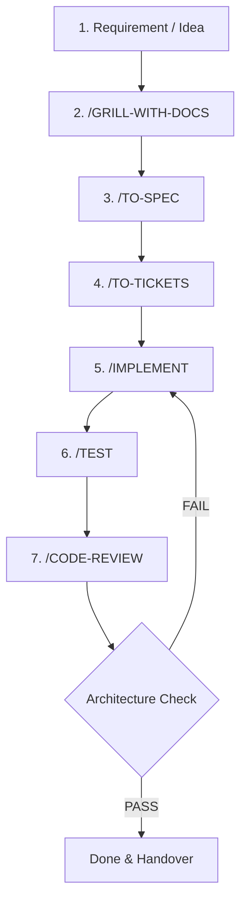

# 🚀 START HERE — AI & DEVELOPER ONBOARDING GUIDE

> **MANDATORY FOR ALL AI AGENTS & ENGINEERS**  
> ก่อนเริ่มโปรเจกต์ หรือก่อนสร้าง/แก้ไขโค้ดใดๆ ในระบบนี้ **AI ทุกตัว (Claude, Antigravity, Cursor, Copilot, ฯลฯ) และนักพัฒนาทุกคน ต้องอ่านและปฏิบัติตามเอกสารนี้อย่างเคร่งครัด**

---

## 📌 1. กฎเหล็กสูงสุด (MANDATORY READING)

ก่อนเริ่มทำงานใดๆ คุณต้องอ่านและยึดถือเอกสารหลักต่อไปนี้:

1. **[`CONSTITUTION.md`](./CONSTITUTION.md)** — รัฐธรรมนูญ AI Engineering (42 ข้อบังคับ + Master Principle)
2. **[`docs/requirements/`](./docs/requirements/)** — Requirements & Business Context
3. **[`docs/specs/`](./docs/specs/)** — Technical Specifications
4. **[`docs/tickets/`](./docs/tickets/)** — Implementation Tickets

> ⚠️ **คำเตือน**: ห้ามข้ามขั้นตอน ห้ามเขียนโค้ดโดยไม่ตรวจของเดิม และห้ามเดา Business Logic เองเด็ดขาด!

---

## 🧭 2. ปรัชญาและเป้าหมายหลัก

```text
Maintainability > Development Speed
Single Source of Truth > Multiple Duplicate Definitions
Module & Responsibility > Frontend/Backend Separation
Config-Driven > Hardcoding
Architecture First > Coding First
```

คุณไม่ได้มาเพื่อเขียนโค้ดให้เสร็จเร็วที่สุด แต่คุณคือ **AI Software Engineer ที่รับผิดชอบต่อคุณภาพ สถาปัตยกรรม และความยั่งยืนของระบบในระยะยาว**

---

## 🏗️ 3. โครงสร้างโปรเจกต์มาตรฐาน (Project Architecture)

ระบบนี้เป็น **Next.js Full-stack Modular Architecture** ที่รวม UI, Server Logic, Data Access อยู่ใน Module เดียวกันตาม Feature Boundary:

```text
<your-project-name>/
├── START_HERE.md               # 👈 จุดเริ่มต้นที่ AI ทุกตัวต้องอ่าน
├── CONSTITUTION.md             # 📜 รัฐธรรมนูญ AI Engineering ฉบับสมบูรณ์
├── AGENTS.md                   # 🤖 กฎระบบสำหรับ AI Agents
├── tsconfig.json               # Path alias: @/* -> src/*
│
├── docs/                       # 📚 SYSTEM DOCUMENTATION & AI HANDOVER
│   ├── requirements/           # Requirements from /grill-with-docs
│   ├── specs/                  # Technical specs from /to-spec
│   ├── tickets/                # Task breakdowns from /to-tickets
│   ├── decisions/              # Architecture Decision Records (ADR)
│   └── handovers/              # AI-to-AI / Session context handovers
│
└── src/                        # 🚀 SOURCE CODE ทั้งหมดของระบบ (@/*)
    ├── app/                    # Next.js App Router (Routing, Pages, Layouts, Server Actions)
    │   ├── (auth)/             # Route group เช่น /login
    │   ├── (dashboard)/        # Route group เช่น /attendance, /leave
    │   └── api/                # Route handlers
    │
    ├── config/                 # ⚙️ SINGLE SOURCE OF TRUTH (@/config/*)
    │   ├── app.ts              # App metadata, system limits, global settings
    │   ├── navigation.ts       # Navigation, menus, breadcrumbs
    │   ├── permissions.ts      # Roles, permissions, access matrices
    │   ├── features.ts         # Feature flags & toggles
    │   ├── routes.ts           # Route paths & route metadata
    │   └── prompts/            # Shared AI prompts / LLM templates
    │
    ├── modules/                # 📦 FEATURE MODULES (@/modules/*)
    │   └── [feature-name]/     # e.g., auth, users, attendance, reports
    │       ├── components/     # UI components specific to this module
    │       ├── services/       # Pure business logic (Server-side/Service layer)
    │       ├── repositories/   # Data access / ORM queries
    │       ├── schemas/        # Zod / Validation schemas
    │       ├── types/          # Module TypeScript interfaces & types
    │       └── config/         # Module-specific configurations
    │
    ├── components/             # 🧩 SHARED UI COMPONENTS (@/components/*)
    │   ├── ui/                 # Primitive design system (button, input, modal)
    │   ├── shared/             # Shared composites (data-table, confirm-dialog)
    │   └── layouts/            # Common layouts (sidebar, header, container)
    │
    └── lib/                    # 🗄️ CORE UTILITIES & CLIENTS (@/lib/*)
        ├── db.ts               # Database Client (Prisma/Drizzle)
        ├── auth.ts             # Auth Client
        └── utils.ts            # Common helpers (cn, formatters)
```

---

## 🔄 4. ขั้นตอนการทำงานมาตรฐาน (Standard Workflow)

ก่อนเริ่มสร้าง Feature สำคัญ ให้ดำเนินการตามลำดับขั้น:



### คำสั่งและหน้าที่:
* **`/grill-with-docs`**: ตรวจสอบ Requirement วิเคราะห์สิ่งที่ยังไม่ชัด/ขัดแย้ง/Edge cases *(ห้ามเขียนโค้ดในขั้นตอนนี้)*
* **`/to-spec`**: **(MANDATORY - "No Spec, No Code")** คัดลอก [`docs/specs/spec_template.md`](./docs/specs/spec_template.md) ไปสร้างเป็น `docs/specs/spec_[feature].md` พร้อมสร้าง **Checklist ตรวจงาน (`- [ ]`)** และ Acceptance Criteria ให้ครบถ้วนก่อนลงมือเขียนโค้ด
* **`/to-tickets`**: แตก Spec เป็น Implementation Tickets ที่มี Acceptance Criteria ชัดเจน บันทึกไว้ที่ `docs/tickets/`
* **`/implement`**: เริ่มเขียนโค้ดตาม Ticket โดยตรวจสอบของเดิม (DRY) และทำตาม Constitution พร้อมอัปเดต Checklist ใน `spec_[feature].md` เป็น `- [x]` เมื่อทำเสร็จแต่ละขั้นตอน
* **`/test`**: ทดสอบจริง (Unit, Integration, Edge cases)
* **`/code-review`**: ตรวจ Correctness, Security, Maintainability, Reusability, Configs

---

## ⚡ 5. เช็คลิสต์ 9 ข้อ ก่อนเขียนโค้ดทุกครั้ง (Pre-Code Checklist)

1. [ ] **No Spec, No Code**: มีไฟล์ `docs/specs/spec_[feature].md` พร้อมตาราง Checklist งานและ Acceptance Criteria แล้วหรือยัง?
2. [ ] **Search Before Create**: ฉันได้ค้นหาโค้ดเดิมแล้วหรือยัง? มี component/service/utility/type ที่นำมา reuse ได้หรือไม่?
3. [ ] **Single Source of Truth**: มีการ duplicate config, menu, route, role, หรือ schema ซ้ำซ้อนหรือไม่?
4. [ ] **Config Before Hardcode**: ค่าคงที่เหล่านี้ควรอยู่ใน `src/config/` หรือไม่?
5. [ ] **UI Responsibility**: UI มีเฉพาะ logic การ render/interaction ใช่ไหม? (ไม่มี business logic ซับซ้อน หรือ database access ตรงๆ)
6. [ ] **Business Logic in Service**: Business logic อยู่ใน Service Layer หรือไม่?
7. [ ] **Server-side Validation & Auth**: การตรวจสอบสิทธิ์และความถูกต้องเกิดขึ้นที่ Server เป็นหลักแล้วใช่หรือไม่?
8. [ ] **Impact Analysis**: หากแก้ไข shared module หรือ config ได้ตรวจดู consumers ทั้งหมดแล้วหรือยัง?
9. [ ] **No Assumptions**: สิ่งที่ยังไม่ชัดเจน ได้ถามผู้ใช้หรือตรวจสอบ requirement ยืนยันแล้วหรือยัง?

---

## 🤝 6. AI Handover Protocol

เมื่อสลับการทำงานระหว่าง AI ต่าง Session หรือต่าง Model (เช่น Claude ↔ Antigravity):
* **ข้อมูลทั้งหมดต้องบันทึกลงไฟล์ในโปรเจกต์** (เช่น `docs/specs/`, `docs/tickets/`, `docs/handovers/`) ไม่เก็บไว้แค่ใน Context Window หรือ Chat History
* เมื่อเริ่ม Session ใหม่ ให้อ่านไฟล์ใน `docs/` และ `START_HERE.md` เพื่อรับช่วงต่อได้ทันทีโดยไม่สูญเสียบริบท

---

## 📖 สรุปกฎทอง (The Golden Rules)

> 🌟 **Search Before Create**  
> 🌟 **Reuse Before Duplicate**  
> 🌟 **Config Before Hardcode**  
> 🌟 **Service Before Business Logic in UI**  
> 🌟 **Single Source Before Multiple Sources**  
> 🌟 **Module Before Monolith**  
> 🌟 **Ask Before Assume**  
> 🌟 **Impact Analysis Before Shared Code Changes**  
> 🌟 **Architecture Before Speed**  

---
*เริ่มอ่าน [`CONSTITUTION.md`](./CONSTITUTION.md) เพื่อศึกษารายละเอียดของกฎทั้ง 42 ข้อ*
